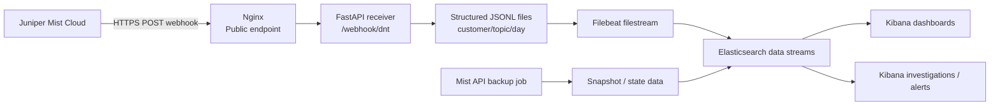
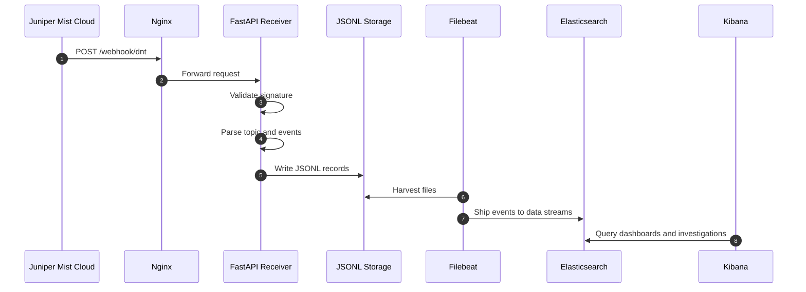
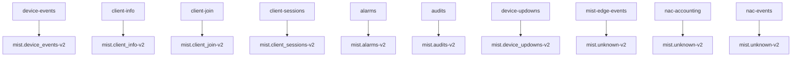
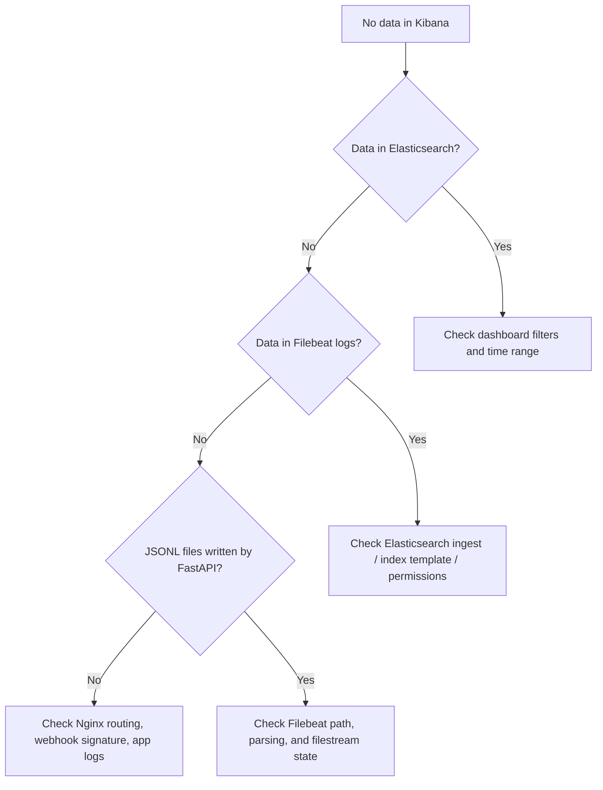

<div align="center">

# ⚡ Mist Observability Showcase

### Juniper Mist → Nginx → FastAPI → Filebeat → Elasticsearch → Kibana

**A production-style observability pipeline for receiving, validating, enriching, shipping, and visualizing Mist webhook events.**

<p>
  
  
  
  
  
  
</p>

<p>
  
  
  
  
</p>

</div>

---

## ✨ Executive Summary

This repository captures a **real Mist-to-Elastic implementation** where **Juniper Mist Cloud** sends webhook events to a public HTTPS endpoint, **Nginx** proxies traffic to a **FastAPI** receiver, events are validated and stored as structured **JSONL**, then forwarded by **Filebeat** into **Elasticsearch** and analyzed in **Kibana**.

It is built to give fast operational visibility into:

- client activity and session behavior
- alarms, audits, and device up/down events
- switch port flap investigations
- site and SSID usage distribution
- data ingest flow and observability pipeline health

---

## 🧭 Architecture at a Glance



---

## 🎯 What This Project Shows

<table>
<tr>
<td width="33%">

### 🌐 Edge Layer
Public HTTPS exposure with Nginx, path-based routing, and a clean webhook entrypoint.

</td>
<td width="33%">

### ⚙️ Ingest Layer
FastAPI validates `x-mist-signature-v2`, enriches records, normalizes timestamps, and writes JSONL.

</td>
<td width="33%">

### 📊 Observability Layer
Filebeat ships events into Elasticsearch where Kibana dashboards expose trends, anomalies, and operations data.

</td>
</tr>
</table>

---

## 🏷️ Showcase Categories

<div align="center">

| Category | Purpose | Repo Area |
|---|---|---|
| **📡 Source** | Mist webhooks and event topics | `webhook/`, `docs/current-deployment-dnt.md` |
| **🛡️ Edge** | Public endpoint, TLS, reverse proxy | `nginx/` |
| **⚙️ Ingest** | Validation, normalization, enrichment, JSONL writes | `webhook/` |
| **🚚 Shipping** | File harvesting and forwarding | `filebeat/` |
| **🗃️ Search & Storage** | Data streams and queryable records | `elastic/` |
| **📈 Visualization** | Dashboards, tables, KQL ideas, analysis views | `kibana/` |
| **🧰 Operations** | Backup scripts, runbooks, next steps | `scripts/`, `docs/` |

</div>

---

## 🧱 Technology Stack

| Layer | Component | Role |
|---|---|---|
| Source | **Juniper Mist** | Delivers webhook topics and API state data |
| Edge | **Nginx** | Exposes the webhook endpoint and proxies requests |
| Ingest | **FastAPI** | Validates signature, parses payloads, enriches records |
| Persistence | **JSONL files** | Durable local event spool per topic/day |
| Shipping | **Filebeat** | Harvests files and sends records onward |
| Storage | **Elasticsearch** | Stores Mist datasets as searchable time-series data |
| Visualization | **Kibana** | Dashboards, Lens visualizations, tables, filtering |
| Automation | **Python scripts** | Backup jobs and future enrichment/state sync |

---

## 🗂️ Repository Layout

```text
.
├── docs/              # Architecture, deployment notes, runbooks, roadmap
├── webhook/           # FastAPI Mist receiver
├── nginx/             # Reverse proxy configuration
├── filebeat/          # Filebeat ingest configuration
├── kibana/            # Dashboard notes and search patterns
├── scripts/           # Backup and operational helpers
├── elastic/           # Template and mapping examples
└── examples/          # API / saved-object helper examples
```

---

## 🚀 Key Features

- **Webhook verification** using Mist signature validation
- **Topic-aware dataset routing** into Elastic data streams
- **Structured event persistence** in JSONL for resilience and replay potential
- **Normalized timestamps** and repeatable event fingerprinting
- **Operational dashboards** for sites, SSIDs, alarms, sessions, and port behavior
- **Clear separation of concerns** across edge, ingest, transport, storage, and visualization

---

## 🔄 End-to-End Event Flow



---

## ✅ Confirmed in the Current DNT Setup

The repository and supplied screenshots confirm the following:

- webhook endpoint: `https://mist.labmetrics.dev/webhook/dnt`
- webhook type: `HTTP POST`
- webhook status: enabled
- enabled Mist topics:
  - `Alerts`
  - `Audits`
  - `Client Information`
  - `Client Join`
  - `Client Sessions`
  - `Device Events`
  - `Device Up/Downs`
  - `Mist Edge Events`
  - `NAC Accounting`
  - `NAC Events`
- Kibana dashboard coverage includes:
  - event volume over time
  - events per site
  - alarms by severity
  - device event codes
  - top AP names
  - client activity over time
  - top SSIDs
  - port flap event tables
  - unique devices per SSID

---

## 🧪 Active Data Streams

### Explicitly mapped in `webhook/app.py`

- `logs-mist.device_events-v2-prod`
- `logs-mist.alarms-v2-prod`
- `logs-mist.client_join-v2-prod`
- `logs-mist.client_sessions-v2-prod`
- `logs-mist.client_info-v2-prod`
- `logs-mist.audits-v2-prod`
- `logs-mist.device_updowns-v2-prod`

### Currently falling back to `mist.unknown-v2`

These topics are enabled in Mist but do not yet have dedicated mappings:

- `mist-edge-events`
- `nac-accounting`
- `nac-events`

### Suggested future stream

- `logs-mist.switch_ports_config-v1-prod`

---

## 🧠 Topic Mapping Overview



---

## 📷 Showcase Highlights

<details>
<summary><strong>Dashboard perspective</strong></summary>

The DNT Kibana dashboard shows both high-level and troubleshooting-oriented views, including event timelines, event code counts, site distribution, SSID usage, and unique client/device perspectives.

</details>

<details>
<summary><strong>Webhook perspective</strong></summary>

The Mist webhook configuration confirms the public endpoint, enabled topics, and the current scope of the integration. This is directly reflected in the repository documentation.

</details>

<details>
<summary><strong>Pipeline perspective</strong></summary>

The repo documents the path from webhook receipt to analytics: **Mist → Nginx → FastAPI → JSONL → Filebeat → Elasticsearch → Kibana**.

</details>

---

## 🛠️ Quick Start Reading Order

Start here if you want the fastest way to understand the implementation:

1. `README.md`
2. `docs/solution-sketch.md`
3. `webhook/app.py`
4. `nginx/mist.labmetrics.dev.conf`
5. `filebeat/filebeat.yml`
6. `kibana/mist-overview-dashboard.md`
7. `docs/runbook-filebeat-elastic.md`
8. `scripts/backup_mist.py`

---

## 🚨 Current Gaps

- missing explicit dataset mappings for `mist-edge-events`, `nac-accounting`, and `nac-events`
- Kibana saved objects are not yet version-controlled in exported JSON form
- ingest health is not yet visualized end-to-end as a dedicated operational dashboard
- no built-in replay pipeline or dead-letter handling for malformed/nonstandard event shapes
- configuration snapshot ingestion is still only partially represented in the repo

---

## 🗺️ Roadmap

- [ ] Add explicit dataset mappings for all enabled Mist webhook topics
- [ ] Export and version-control Kibana saved objects
- [ ] Build pipeline health dashboards
- [ ] Add alerting for missing events and abnormal port flap patterns
- [ ] Ingest switch-port configuration snapshots and backup state data
- [ ] Add deployment examples for lab and production-style environments

---

## 🧩 Troubleshooting View



---

## 📌 Evidence Reflected in This Repo

This showcase README and the surrounding docs were updated from the provided materials:

- DNT Mist webhook configuration screenshot
- Kibana dashboard screenshots for `Mist Overview - DNT`
- uploaded `app.py` webhook receiver implementation
- uploaded Nginx configuration for the public endpoint

---

## 📄 Usage Note

This repository is best treated as a **reference implementation / lab-style deployment**. Before reusing it elsewhere, adjust:

- customer IDs and names
- URLs and hostnames
- local file paths
- secret handling
- environment variable conventions
- data stream naming and retention strategy

