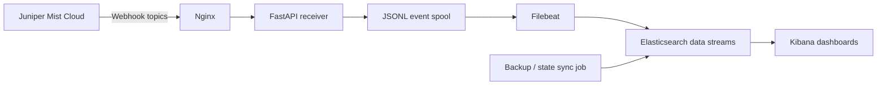
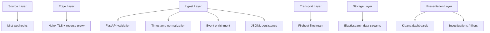
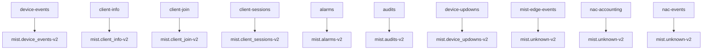
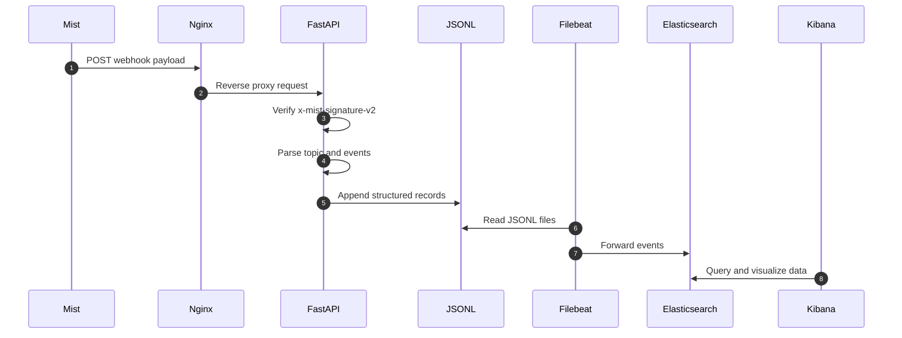
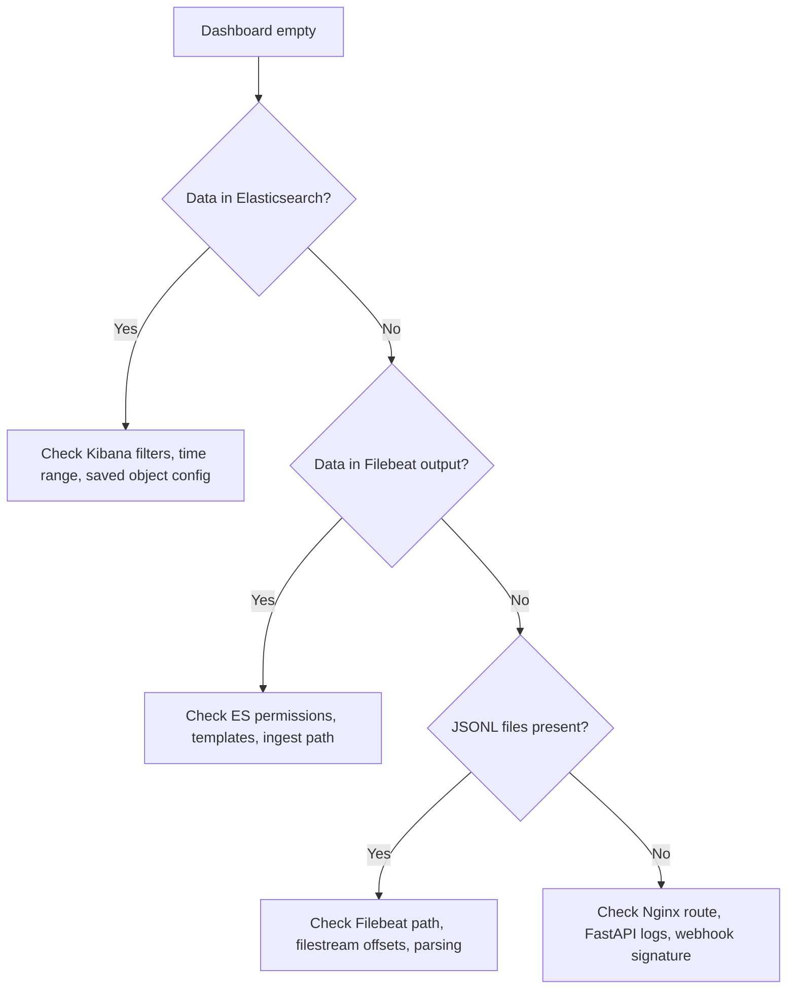
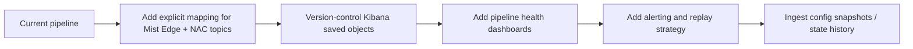

# Solution Sketch

This document provides a compact visual overview of the Mist observability solution documented in this repository.

## 1. High-Level Architecture

## 2. Logical Responsibility Split

## 3. Topic to Dataset Mapping

## 4. Request Lifecycle

## 5. Troubleshooting Path

## 6. Suggested Next Evolution

